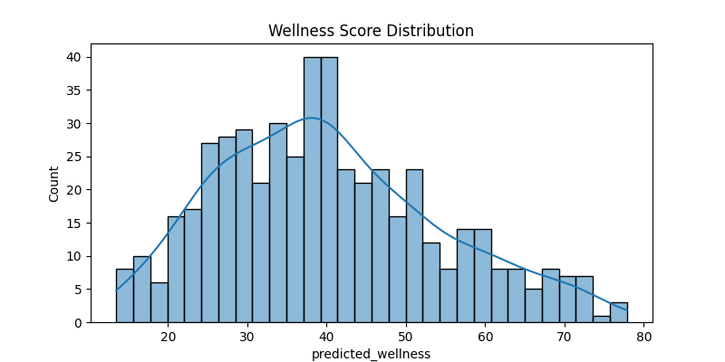

Wearable Data Wellness & Anomaly Detector
📌 Overview

FitSense is a machine learning pipeline that uses wearable device data (heart rate, steps, sleep, activity) to:

Detect health anomalies in user patterns.

Predict a personal wellness score (0–100).

Provide insights & trends for personal health monitoring.

It ingests wearable sensor data (CSV/JSON), performs feature engineering, trains ML models, and produces predictions, insights, and visualizations.

⚙️ Features

✅ Ingests CSV/JSON data with wearable signals
✅ Feature engineering (rolling averages, HRV, circadian features, sleep quality)
✅ Wellness score prediction using Random Forest
✅ Anomaly detection using Isolation Forest
✅ Exports:

wellness_model.pkl → trained wellness model

anomaly_model.pkl → anomaly detection model

predictions.csv → predicted wellness + anomalies

processed_wearables.h5 → numeric processed dataset

insights.json → summary insights

build_metadata.yaml → pipeline metadata
✅ Visuals:

Predicted vs Actual accuracy graph

Accuracy heatmap (binned regression)

Wellness distribution histogram

Feature correlation heatmap

Time-series anomaly plot

📂 Project Structure
Wearable Data Wellness Anomaly Detector/
│
├── archive/
│   └── wearable_sports_health_dataset.csv   # Input dataset
│
├── wellness_model.pkl        # Trained wellness model
├── anomaly_model.pkl         # Trained anomaly detector
├── predictions.csv           # Predictions with anomaly flags
├── processed_wearables.h5    # Processed dataset (numeric only)
├── insights.json             # Insights & summary stats
├── build_metadata.yaml       # Build metadata
└── visuals/                  # Visualization outputs
    ├── accuracy_graph.png
    ├── accuracy_heatmap.png
    ├── wellness_distribution.png
    ├── correlation_heatmap.png
    └── anomaly_timeseries.png

🗂️ Dataset

The project uses the Wearable Sports Health Dataset:

Columns:

Record_ID, Athlete_ID, Timestamp,

Heart_Rate, Body_Temperature, Blood_Pressure, Blood_Oxygen,

Step_Count, Activity_Status, Latitude, Longitude, Secure_Transmission_Status

Mapped internally as:

Heart_Rate → heart_rate

Step_Count → steps

Timestamp → timestamp

🚀 Usage
1️⃣ Train & Build Pipeline

Run the pipeline script:

python pipeline.py

It will:

Train models.

Save artifacts (pkl, h5, yaml, json, csv).

Show evaluation plots.

2️⃣ Predict on Dataset

Run the prediction script:

python predict.py

It will:

Load trained models.

Run predictions on the dataset.

Save predictions.csv.

Print summary on screen.

📊 Outputs
✅ Predictions (predictions.csv)
timestamp	heart_rate	steps	predicted_wellness	anomaly_flag	anomaly_score
2024-01-01 00:00:00	75	1200	82.3	1	0.045
2024-01-01 01:00:00	88	200	70.5	-1	-0.120

anomaly_flag = -1 → anomaly

anomaly_flag = 1 → normal

✅ Insights (insights.json)
{
  "build_time": "2025-09-29T09:20:00",
  "avg_wellness": 78.42,
  "anomaly_rate": 6.5,
  "top_anomalies": [
    {
      "timestamp": "2024-01-05 02:00:00",
      "heart_rate": 102,
      "steps": 50,
      "predicted_wellness": 62.1
    }
  ]
}

🛠️ Tech Stack

Python (3.11)

Pandas, NumPy → data handling

Scikit-learn → ML models (RandomForest, IsolationForest)

Seaborn, Matplotlib → visualization

h5py → HDF5 storage

YAML, JSON → metadata + insights

📊 Business Wins

Early anomaly alerts can prevent health risks.

Personalized wellness scores boost user engagement.

Insurance & healthcare → risk scoring.

Corporate wellness → better recommendations.

🔮 Future Improvements

Include additional features: Body_Temperature, Blood_Pressure, Blood_Oxygen.

Use LightGBM / XGBoost for wellness scoring.

Deep learning autoencoder for anomaly detection.

Deploy via FastAPI + dashboard.

Integrate with real wearable APIs (Fitbit, Apple Health, Garmin).
Author
SAGNIK PATRA
